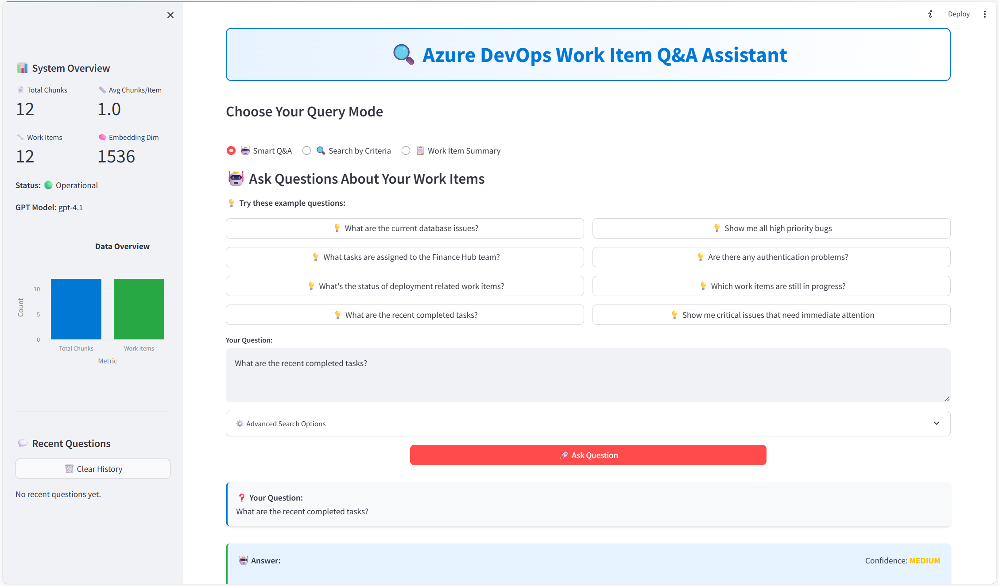

# Azure DevOps RAG System

This project provides a complete **Retrieval-Augmented Generation (RAG) system** for Azure DevOps work items, combining data collection, intelligent processing, and AI-powered question answering capabilities. The system features both command-line tools and a modern web interface for interacting with your work item data.

## Features



### 🌐 **Streamlit Web Interface**
- **Smart Q&A Mode**: Ask natural language questions about work items with confidence scoring
- **Search by Criteria Mode**: Find work items using specific filters (assignee, status, type, priority)
- **Work Item Summary Mode**: Get AI-generated summaries of work items by ID or criteria
- **Interactive Dashboard**: Real-time system statistics and data visualizations
- **Chat History**: Track your query history and results
- **Advanced Settings**: Configurable similarity thresholds, temperature, and result limits

### 🤖 **AI-Powered Features**
- **Semantic Search**: Vector-based similarity search using Azure OpenAI embeddings
- **Context-Aware Answers**: RAG (Retrieval-Augmented Generation) with GPT-4 for intelligent responses
- **Confidence Scoring**: Automatic assessment of answer reliability
- **Batch Processing**: Handle multiple queries efficiently
- **Source Attribution**: Clear references to supporting work items

### 📊 **Data Processing Pipeline**
- **Automated Data Collection**: Fetch work items from Azure DevOps API
- **Intelligent Cleaning**: HTML sanitization and text normalization
- **Smart Chunking**: Context-preserving text segmentation
- **Vector Embeddings**: High-dimensional representations for semantic search
- **Incremental Updates**: Efficient processing of new or changed work items

## Script Overview

### **Node.js Data Collection Scripts**
- **`get_workitem.js`**: Fetches all work items in the current sprint with basic fields (ID, title, state, assigned user) and saves to `workitems.json`
- **`get_workitem_detail.js`**: Retrieves comprehensive work item details including descriptions, comments, relationships, and attachments for current sprint items
- **`get_workitem_id.js`**: Prompts for specific work item ID and recursively fetches detailed information for that item and all related work items

### **Python Data Processing Pipeline**
- **`cleaner.py`**: Cleans and normalizes work item data by removing HTML tags, standardizing text, and preparing data for chunking
- **`chunker.py`**: Splits cleaned work items into semantic chunks using RecursiveCharacterTextSplitter for optimal embedding generation
- **`embedding.py`**: Generates vector embeddings for text chunks using Azure OpenAI's text-embedding-ada-002 model with retry logic and rate limiting

### **RAG System Components**
- **`ado_vector_store.py`**: Vector similarity search implementation with configurable similarity thresholds and metadata filtering
- **`ado_qa_system.py`**: Comprehensive RAG question-answering system with multiple query modes, confidence scoring, and batch processing
- **`streamlit_app.py`**: Full-featured web interface providing user-friendly access to all RAG capabilities with modern UI/UX

## Data Storage Structure

The system uses a structured approach to data storage across multiple stages:

### **Raw Data Collection (`storage/` directory)**
- `storage/workitem_*.json` — Individual work item data files with detailed information, relationships, and attachments
- `storage/workitem_details.json` — Comprehensive data for all current sprint work items and their relationships
- `storage/workitem_images/` — Downloaded images and attachments organized by work item ID

### **Processing Pipeline (`stage/` directory)**
- `stage/cleaned_workitems.json` — Sanitized and normalized work item data ready for chunking
- `stage/chunked_workitems.json` — Text chunks with metadata for embedding generation
- `stage/workitem_embeddings.json` — Vector embeddings with associated metadata for semantic search

## Getting Started

### **1. Environment Setup**

#### Create Virtual Environment
```powershell
python -m venv venv
.\venv\Scripts\activate
```

#### Install Dependencies
```powershell
# Install Node.js dependencies for data collection
npm install

# Install Python dependencies for RAG system
pip install -r requirements.txt
```

### **2. Configuration**

Create a `.env` file in the project root with your Azure credentials:

```env
# Azure DevOps Configuration
AZURE_DEVOPS_ORG_URL=https://dev.azure.com/yourorg
AZURE_DEVOPS_PROJECT=YourProject
AZURE_DEVOPS_TEAM=YourTeam
AZURE_DEVOPS_PAT=your_personal_access_token

# Azure OpenAI Configuration
AZURE_OPENAI_ENDPOINT=https://your-resource.openai.azure.com/
AZURE_OPENAI_API_KEY=your_api_key
AZURE_OPENAI_DEPLOYMENT_NAME=your_gpt_deployment
AZURE_OPENAI_EMBEDDING_DEPLOYMENT=your_embedding_deployment
AZURE_OPENAI_API_VERSION=2024-02-01
```

### **3. Data Collection and Processing**

#### Step 1: Collect Work Item Data
```powershell
# Fetch current sprint work items with full details
node get_workitem_detail.js
```

#### Step 2: Run Complete Processing Pipeline
```powershell
# Clean the raw data
python cleaner.py

# Create semantic chunks
python chunker.py

# Generate embeddings
python embedding.py
```

### **4. Launch the RAG System**

#### Web Interface (Recommended)
```powershell
streamlit run streamlit_app.py
```
Access the web interface at `http://localhost:8501`

#### Command Line Interface
```python
from ado_qa_system import ADOQASystem

# Initialize the system
qa_system = ADOQASystem()

# Ask questions
response = qa_system.answer_question("What are the current high priority bugs?")
print(response)

# Search by criteria
results = qa_system.search_by_criteria(assignee="john.doe", status="Active")
print(results)

# Get work item summary
summary = qa_system.summarize_workitem(12345)
print(summary)
```

### **5. Using the Web Interface**

1. **Smart Q&A Mode**: 
   - Ask natural language questions about your work items
   - Use suggested questions or type your own
   - Get confidence-scored answers with source references

2. **Search by Criteria Mode**:
   - Filter work items by assignee, status, type, or priority
   - Combine multiple criteria for precise results
   - Export results for further analysis

3. **Work Item Summary Mode**:
   - Get AI-generated summaries of specific work items
   - Bulk summarization of multiple work items
   - Customizable summary depth and focus

4. **Advanced Settings**:
   - Adjust similarity thresholds for search precision
   - Configure AI temperature for response creativity
   - Set result limits for performance optimization

## Next Steps

- **Custom Integrations**: Extend the RAG system with custom data sources or specialized processing
- **Advanced Analytics**: Build dashboards and reports using the processed work item data
- **Automation**: Set up scheduled data collection and processing pipelines
- **Team Collaboration**: Share insights and summaries across development teams
